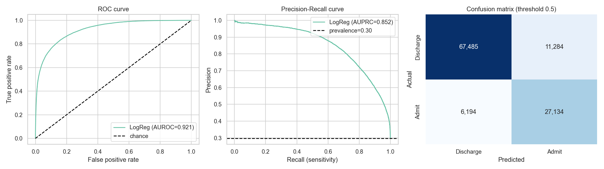

# Predicting Hospital Admission at Emergency Department Triage

**Author:** Justin Moore

## Executive summary

Emergency departments get crowded largely because of boarding, where patients who have already been
admitted wait in the ED for an inpatient bed to open up. A lot of that delay traces back to how late
the admission decision gets made. If we could tell at triage which patients are likely to be
admitted, the hospital could start looking for a bed hours earlier. This project builds a model to do
that, using only what is known when the triage nurse finishes their assessment.

The data is a public cohort of 560,486 ED visits. A logistic regression built with strict controls
against data leakage reaches an AUROC of 0.921 (0.921 +/- 0.001 across 5-fold cross-validation) and
catches about 81% of true admissions at the default threshold. It uses no lab or imaging results,
since those are generated after triage and would hand the model information it would not actually
have at decision time. The numbers here reflect what is realistically achievable at triage.

## Rationale

Boarding is bad for patients (worse outcomes, longer stays) and hard on hospital operations. The
admission decision often is not settled until labs and imaging come back, which can be hours after
the patient arrives. An estimate of admission probability at triage would let charge nurses and bed
managers get the admission process moving earlier instead of waiting for the workup to finish.

## Research Question

Can we predict whether an ED patient will be admitted to the hospital using only information
available at triage?

This is a binary classification problem: `disposition` is Admit (1) versus Discharge (0).

## Data Sources

- Dataset: hospital triage and patient-history data (Yale ED cohort), public and fully de-identified.
- Reference: Hong WS, Haimovich AD, Taylor RA. "Predicting hospital admission at emergency department
  triage using machine learning." PLoS ONE 2018;13(7):e0201016.
- Size: 560,486 visits and 972 columns covering demographics, triage vitals, chief complaints, prior
  medical history, prior utilization, and post-triage labs and imaging.
- Target balance: 70.3% Discharge, 29.7% Admit (about 2.36 to 1).

The raw data (around 1.5 GB) is not in this repository. It can be downloaded from Kaggle. The
expected local path is in `requirements.txt` and the notebook header.

## Methodology

The notebook follows the CRISP-DM process.

1. Data understanding: profiled the target, data types, and missingness. Missingness is split, with
   about 380 columns complete and about 350 more than half empty (mostly lab values).
2. Leakage control: this was the main decision in the project. I sorted every column by when its
   value becomes known and kept the 554 features available at triage (ESI, triage vitals, chief
   complaints, demographics, prior medical history, prior utilization). I dropped the 416 features
   that only exist after triage: lab aggregates (`_last`, `_min`, `_max`, `_median`), lab and imaging
   counts (`_count`, `_npos`), and repeated in-department vitals.
3. Data preparation: removed 2 exact duplicate rows, set physiologically impossible vital values to
   missing, median-imputed the numeric features, added indicator flags so missingness is kept as
   signal, and one-hot encoded the categoricals with an explicit "Missing" level.
4. Feature engineering: abnormal-vital flags (tachycardia, hypotension, hypoxia, fever, tachypnea),
   shock index (HR/SBP), counts of comorbidities, complaints, and medication classes, and age bands.
5. Modeling: a DummyClassifier as a floor and a logistic regression baseline with
   `class_weight="balanced"`, using a stratified 80/20 split and 5-fold stratified cross-validation.

On metrics: the classes are imbalanced at roughly 70/30, so accuracy is the wrong thing to optimize.
A model that predicts "discharge" for everyone is 70% accurate and useless. I report AUROC as the
main metric, since it measures ranking quality independent of any threshold and is standard for
clinical risk scores, along with AUPRC, which is more sensitive to the admitted patients. I also
report the confusion matrix and sensitivity/specificity, because in this setting a missed admission
matters more than a false alarm.

## Results

| Model | AUROC | AUPRC | Sensitivity | Specificity | PPV |
|---|---|---|---|---|---|
| Dummy (majority class) | 0.500 | n/a | n/a | n/a | n/a |
| Logistic Regression (baseline) | 0.921 | 0.852 | 0.814 | 0.857 | 0.706 |

- The cross-validated AUROC was 0.921 +/- 0.001, so the result does not depend on one particular
  split.
- The model ranks a random admitted patient above a random discharged patient about 92% of the time,
  with no lab or imaging data.
- The strongest predictors are low ESI (high acuity), arrival by ambulance, older age, abnormal
  vitals (high heart and respiratory rate, low oxygen, elevated shock index), and a heavier prior
  medical history. These are the factors clinicians already weigh at the bedside.
- Admission rate tracks ESI closely, falling from 85.6% at ESI 1 to 0.4% at ESI 5.

At triage, using acuity, vital signs, chief complaint, age, arrival mode, and prior history, the
model can flag patients who are likely to be admitted. That is early enough to start bed planning
before the workup finishes, which is usually when boarding builds up.

## Limitations

- This is a prediction, not a causal finding. The model says who is likely to be admitted. It does
  not show that acting on the prediction improves outcomes or reduces boarding, which would take a
  prospective trial.
- The data comes from a single health system, so the model would need to be tested on other sites
  before being used.
- I kept a few historical fields (`previousdispo`, `n_admissions`) because they pre-date the visit.
  A more conservative version could drop them.
- Logistic regression is linear, so it cannot capture interactions between features.

## Next steps

1. Test more flexible models (decision trees, random forests, gradient boosting) with
   cross-validation and tuned hyperparameters to see whether they beat the linear baseline.
2. Tune the decision threshold to a clinically meaningful point, such as catching at least 90% of
   admissions, and report how many alerts that produces.
3. Compare the most important features across models to check that the main predictors are stable.
4. Validate on data from a different time period or site before trusting the model in practice.

## Outline of project

- [Initial Report and EDA notebook](notebooks/initial_report_eda.ipynb)

## Contact and Further Information

Justin Moore

GitHub: [@moorej44](https://github.com/moorej44)
